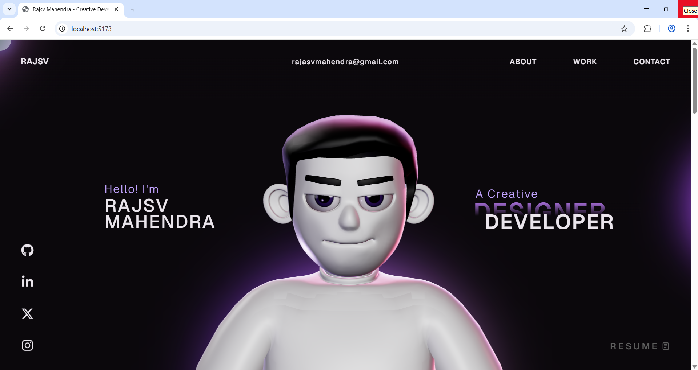

# My Portfolio Website – Overview 🚀

This repository contains the open-source version of my portfolio website.
Feel free to explore the code and structure.

## Preview 👀

## Instructions 🛠️

This project uses GSAP Club plugins. For local development, I have replaced them with trial plugins.  
⚠️ Trial plugins cannot be used for hosting.

For full GSAP Club plugin installation, refer to:
https://gsap.com/docs/v3/Installation/

## Tech Stack 🧩

- React  
- TypeScript  
- GSAP  
- Three.js  
- WebGL  
- HTML  
- CSS  
- JavaScript  

## License 📄

This project is open source and available under the [MIT License](LICENSE).
